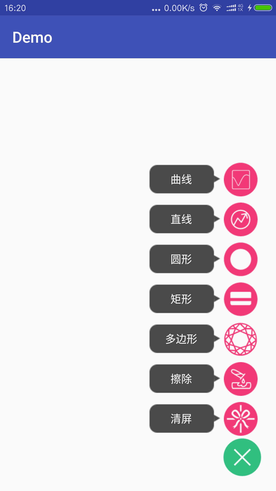

#FloatViewGroup

>悬浮的一组按钮

##gradle
```
compile 'cn.lemon:floatviewgroup:1.0.0'
```

##使用

 - xml

```xml
    <cn.lemon.view.FloatViewGroup
        android:id="@+id/float_view_group"
        android:layout_width="wrap_content"
        android:layout_height="wrap_content"
        android:layout_alignParentBottom="true"
        android:layout_alignParentRight="true"
        android:layout_margin="16dp" />
```

 - Java

>自定义Adapter继承FloatAdapter

```java
class FunctionAdapter extends FloatAdapter {

    private String[] mHints = {"清屏","擦除","多边形","矩形", "圆形", "直线", "曲线"};
    private int[] mDrawables = {R.drawable.ic_clear,R.drawable.ic_wipe,R.drawable.ic_multi_line,
            R.drawable.ic_rectangle, R.drawable.ic_oval, R.drawable.ic_line, R.drawable.ic_curve};

    public FunctionAdapter(Context context) {
        super(context);
    }

    @Override
    public int getCount() {
        return mHints.length;
    }

    @Override
    public String getItemHint(int position) {
        return mHints[position];
    }

    @Override
    public int getItemResource(int position) {
        return mDrawables[position];
    }

    @Override
    public int getMainResource() {
        return R.drawable.ic_float_switch;
    }

    @Override
    public void onItemClick(int position) {
        Toast.makeText(getContext(),"点击",Toast.LENGTH_SHORT).show();
    }
}
```

```
mFloatViewGroup = (FloatViewGroup) findViewById(R.id.float_view_group);
mFloatViewGroup.setAdapter(new FunctionAdapter(this));
```

##效果图
